## DNS for Penetration Testers
**An attacker perspective with a chance of defender discussion**

#### null/OWASP/G4H BLR Meet 
#### Bharath Kumar
17th June 2017

---

### Agenda

- DNS explained.
- DNS tools.
- DNS attack surface.
- Information gathering through DNS records.
- Mis-configurations in DNS records.
- CAA record & Certificate Transparency.
- Zone transfer attack.
- Zone walking attack.
- Mitigation.

---

“The Domain Name System, or DNS, is one of the Internet’s fundamental building blocks. It is the ** *global*, *hierarchical*, ** and ** *distributed* ** host information database that’s responsible for translating names into addresses and vice versa, routing mail to its proper destination, and many other services.”


<center>[bind9.net](http://www.bind9.net/)</center>

---

### DNS is distributed

----

### DNS is hierarchical

----

<a title="By George Shuklin, based on work of User:Hank van Helvete (File:Dns-raum.svg) [CC BY-SA 1.0 (http://creativecommons.org/licenses/by-sa/1.0)], via Wikimedia Commons" href="https://commons.wikimedia.org/wiki/File%3ADNS-names-ru.svg"></a>

----

### DNS is global

---

### DNS Tools

> [**dig**](https://www.isc.org/downloads/bind/) if you can, [**drill**](https://www.nlnetlabs.nl/projects/ldns/) if you have to, [**nslookup**](https://en.wikipedia.org/wiki/Nslookup) if you must.

---

### DNS resolution flow - Step I

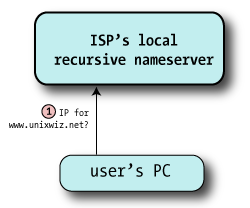

<br>
<br>
[goo.gl/mRMaZl](http://unixwiz.net/techtips/iguide-kaminsky-dns-vuln.html)

----

### Resolver

- Resolver is the client part of the DNS client/server system, it asks the questions about hostnames.
- Resolvers are usually very small and dumb, relying on the servers to do the heavy lifting.

----

### Recursive nameserver

- A nameserver that’s willing to go out and find the results for zones it’s not authoritative for, as a service to its clients.
- Usually ISP provides raw IP address of recursive DNS servers they maintain, for their customers. 
- People unhappy with their ISP’s DNS behavior/performance use third-party recursive name servers(open DNS resolvers).

----

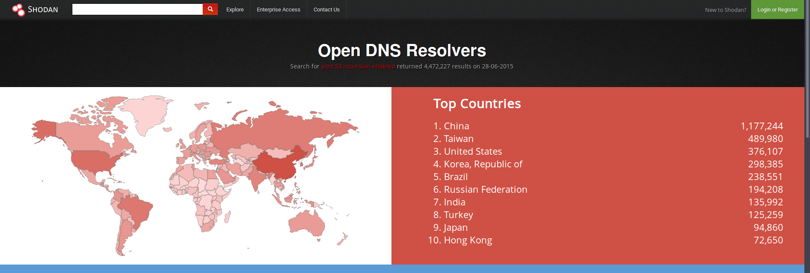


[https://www.shodan.io/report/HNgHMj81](https://www.shodan.io/report/HNgHMj81)

----


----

### DNS resolution flow - Step II

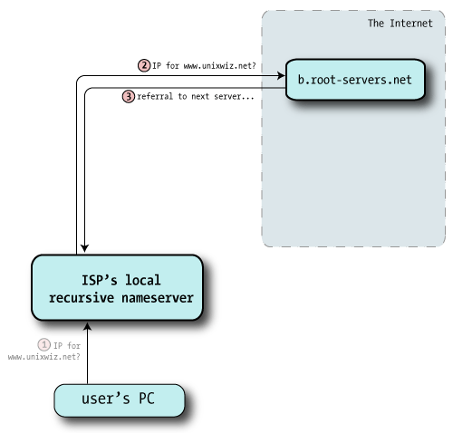

[goo.gl/mRMaZl](http://unixwiz.net/techtips/iguide-kaminsky-dns-vuln.html)

----

### Root name servers

- Root name servers are at the root of the DNS hierarchy.
- They are authoritative for identifying the name servers responsible for the Top Level Domain (TLD).
- They are a network of hundreds of servers in many countries around the world.
- Shares **13 x 2 IP addresses** (13 IPv4, 13 IPv6) using **Anycast** routing.


**[https://www.iana.org/domains/root/servers](https://www.iana.org/domains/root/servers)**

----

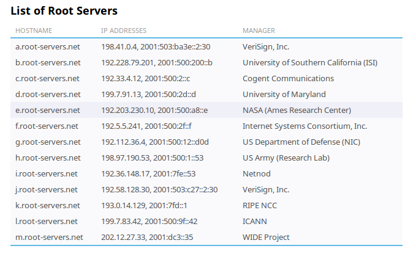

**[https://www.iana.org/domains/root/servers](https://www.iana.org/domains/root/servers)**

----

###### Root servers map

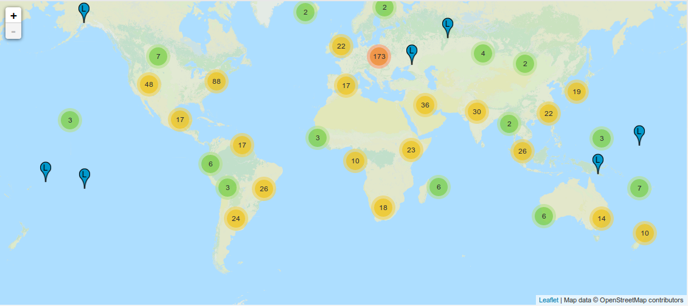

**[http://www.root-servers.org/](http://www.root-servers.org/)**

----

### DNS resolution flow - Step III

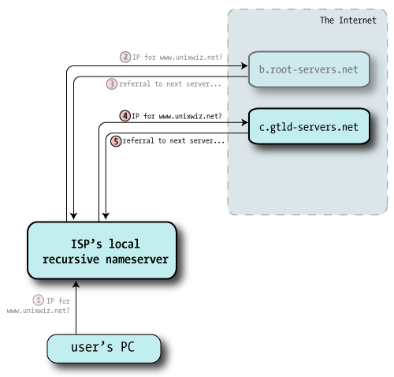

[goo.gl/mRMaZl](http://unixwiz.net/techtips/iguide-kaminsky-dns-vuln.html)

----

### DNS resolution flow - Step IV

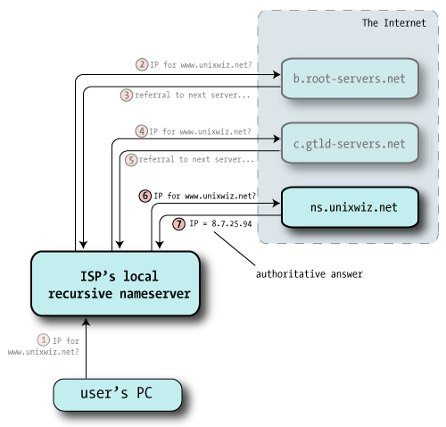

[goo.gl/mRMaZl](http://unixwiz.net/techtips/iguide-kaminsky-dns-vuln.html)

----

### DNS resolution flow - Step V

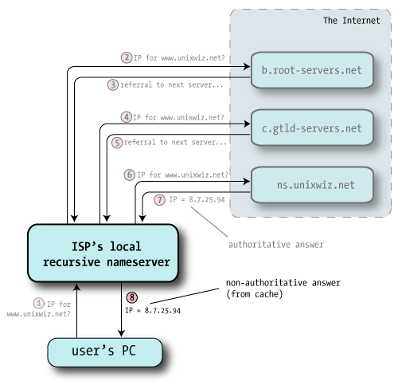

[goo.gl/mRMaZl](http://unixwiz.net/techtips/iguide-kaminsky-dns-vuln.html)

----

### DNS records

| Record      | Purpose                                                                                                  |
|-------------|----------------------------------------------------------------------------------------------------------|
| **A**       | Domain name to an IPv4 adress.                                                    |
| **AAAA**    | Domain name to an IPv6 adress.                                                    |
| **PTR**     | Reverse DNS lookup.(IP address to get hostname.)                                                    |

----

##### DNS records


| Record      | Purpose                                                            |
|-------------|--------------------------------------------------------------------|
| **NS**      | Nameserver responsible for a given domain.                         |
| **MX**      | Mail servers responsible for handling email for the given domain.  |
| **SOA**     | Describes some key data about the zone                             |

----

##### DNS records

| Record      | Purpose                                                            |
|-------------|--------------------------------------------------------------------|
| **TXT**     | A generic Text record that provides descriptive data about domain.                                       |
| **SPF**     | Identifies which mail servers are permitted to send email on behalf of a given domain                                      |
| **CAA**     | Specifies which certificate authorities (CAs) are allowed to issue certificates for a domain.                                     |

----

### "A" record

- An A record maps a domain name to the IP address (IPv4) of the computer hosting the domain.


```bash
dig A insecuredns.com
```

```bash
dig A @8.8.8.8 example.com     # Specify the nameserver with @
```

```bash
dig +short A iana.org          # Display only the IP addresses 
```

----

### "AAAA" record

- AAAA record maps a domain name to the IP address (IPv6) of the computer hosting the domain.


```bash
dig AAAA insecuredns.com
```

```bash
dig AAAA @8.8.8.8 example.com   # Specify the nameserver with @
```

```bash
dig +short AAAA iana.org   # Display only the IP addresses 
```

----

### "PTR" record

- Pointer(PTR) records are used to map a network interface (IP) to a host name.
- These are primarily used for reverse DNS.
- Names can reveal information about the host.

```bash
$ dig +short PTR 4.4.8.8.in-addr.arpa
google-public-dns-b.google.com.
```

```
$ dig +short -x 8.8.8.8
google-public-dns-a.google.com.
```

----

#### "NS" record

- An NS record is used to delegate a subdomain to a set of name servers.
- Lists all the name servers responsible for a given domain.

```bash
dig +short NS insecuredns.com
```

----

#### "MX" record

- MX stands for Mail eXchange. MX Records tell email delivery agents where they should deliver your email.
- You can have many MX records for a domain.(For redundancy)
- MX records will reveal any third-party email service being used.

```bash
dig +short MX insecuredns.com
```

----

#### "SOA" record

- Start Of Authority(SOA) record reveals interesting information about the zone.

- Extract primary nameserver:
 
```bash
$ dig @8.8.8.8 +short SOA wikipedia.org | cut -d' ' -f1
ns0.wikimedia.org.
```

- Extract email address from zone file.

```
$ dig @8.8.8.8 +short SOA internet.org | cut -d' ' -f2
dns.facebook.com.
```

----

#### "TXT" records

- TXT records hold free form text of any type.
- Special type of TXT records act as SPF, DK, DKIM and DMARC records.
- A lot of third-party service providers use TXT records to verify domain ownership and to ensure email security.

----

###### "TXT" records OSINT angle

- TXT records can reveal third-party services used by the domain.

```
"loaderio=6d3df817ccc37b96c16c78e44b62f75e"
```

```
"atlassian-domain-verification=+Mx+ ... snipped..."
```

```
"citrix-verification-code=3d0b3642-... snipped..."
```

```
"smartsheet-site-validation.example.com TXT wfJ... snipped..."
```

----

###### "TXT" records OSINT angle

- TXT records are free form so they may hold some interesting info.

```
TXT "Remember to call or email admin on +44 123 4567890 or dnsmaster@example.com when making DNS changes"
```

----

#### "SPF" records

- SPF records tells third parties what IP addresses/hostnames are expected to send e-mail of the domain.  
- There is a dedicated SPF record type, however, it is deprecated in favor of using a TXT record.

```
300 IN  TXT "v=spf1 a include:spf.mtasv.net ~all"
```

----

#### "SPF" record format

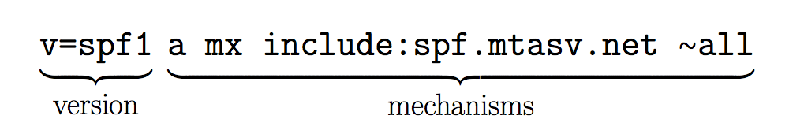

**[https://postmarkapp.com/blog/explaining-spf](https://postmarkapp.com/blog/explaining-spf)**


----

#### "SPF" record format

- SPF record can very just point at the domain its self (A, PTR, MX, etc.) 

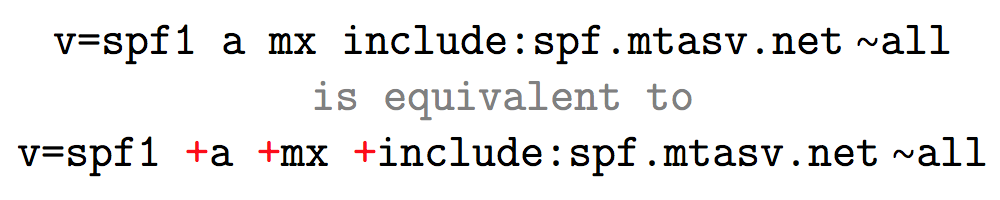

**[https://postmarkapp.com/blog/explaining-spf](https://postmarkapp.com/blog/explaining-spf)**


----

###### SPF qualifiers 


| Qualifier   | Purpose                                                            |
|-------------|--------------------------------------------------------------------|
| **+**       | IP that matches will pass SPF.                                      |
| **-**       | IP that matches will fail SPF.                                     |
| **~**       | IP that matches will soft fail SPF.                                     |
| **?**       | IP that matches  will neither pass or fail SPF.

----

#### "SPF" samples

- Allow domain's MXes to send mail for the domain, prohibit all others.

```
"v=spf1 mx -all"
```


- The domain owner thinks that SPF is useless and/or doesn't care.

```
"v=spf1 +all" 
```

- The domain sends no mail at all.

```
"v=spf1 -all"
```


----

##### "SPF" bad practices

```
v=spf1 all
```

```
v=spf1 +all
```

```
v=spf1 ~ all
```

```
v=spf1include:sendgrid.net~all
```

<br>
**TL;DR**: Use **`-all`** or **`~all`** to terminate your SPF record.(Use DMARC when using SPF softfail)

----

#### "SPF" OSINT angle

- SPF records reveal third-party mail providers that the domain may rely on.

```
"v=spf1" "include:_spf.google.com" "include:mail.zendesk.com" "-all"
```

- SPF sometimes reveals IP addresses (and net blocks) of the organization that you may not have been aware of.

```
"v=spf1 ip4:208.118.237.0/24 ip4:208.118.227.0/25 ip4:64.125.235.5 ip4:64.125.235.6 ip4:205.201.137.229 ip4:209.177.165.0/24 ip4:209.177.171.0/24 ip4:209.177.164.0/24" " include:_spf.google.com include:_spf.salesforce.com include:mktomail.com include:spf.protection.outlook.com -all"
```


[goo.gl/vQPCtB](goo.gl/vQPCtB)

----

### CAA record

- A Certification Authority Authorization (CAA) record is used to specify which certificate authorities (CAs) are allowed to issue certificates for a domain.
- The idea is to allow domain owners to declare which certificate authorities are allowed to issue a certificate for a domain.

```
example.com.  CAA 0 issue "letsencrypt.org"
```

----

#### CAA records

- **`issue`** tag identifies CA that is authroized to issue certificate 
- **`issuewild`** tag identifies CA that is authorized to issue wildcard certificates.
- **`iodef`** contains an email address to notify in case a violation is detected.

```
example.com.     1200    IN  CAA 0 issue "comodoca.com"
example.com.     1200    IN  CAA 0 issuewild "comodoca.com"
example.com.     1200    IN  CAA 0 iodef "mailto:sslabuse@example.com"
```

----

#### Certificate Transparency(CT)

- Certificate Transparency is a recent IETF standard, under which CAs will have to publish all SSL/TLS certificates they issue in a public log.
- Using CT and CAA records, it's easy to identify rogue/fraudelent SSL/TLS certificates in the wild.

---

#### Zone transfer(attack)

- zone transfer is a type of DNS transaction where a DNS server passes a copy of part of it's database(zone file) to another DNS server.
- DNS zone transfer is always initiated by client/slave by inducing **DNS query type AXFR**. 

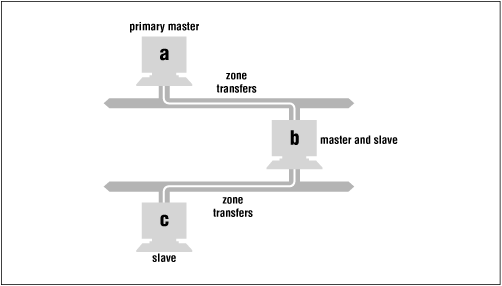

----

#### Zone transfer(Attack)

```bash
$ dig AXFR @ns1.iitk.ac.in. iitk.ac.in
iitk.ac.in.     43200   IN  SOA ns1.iitk.ac.in. root.ns1.iitk.
iitk.ac.in.     43200   IN  NS  ns2.iitk.ac.in.
iitk.ac.in.     43200   IN  NS  proxy.iitk.ac.in.
home.iitk.ac.in.    43200   IN  A   202.3.77.174
m3cloud.iitk.ac.in. 43200   IN  A   103.246.106.161
mail.iitk.ac.in.    43200   IN  A   202.3.77.162

[... snipped ...]

mail4.iitk.ac.in.   43200   IN  A   202.3.77.189
webmail.iitk.ac.in. 43200   IN  A   202.3.77.185
www.webmap.iitk.ac.in.  43200   IN  A   202.3.77.74
wiki.iitk.ac.in.    43200   IN  A   103.246.106.116
www.iitk.ac.in.     43200   IN  A   202.3.77.184
```

---

#### DNSSEC in 2 mins

- DNSSEC is normal DNS, but with cryptographic signatures. It prevents DNS Spoofing.
- DNSSEC provides a layer of security by adding cryptographic signatures to existing DNS records.
- These signatures are stored alongside common record types like A, AAAA, MX etc.
- By checking associated signature, you can verify that a requested DNS records comes from authoritative nameserver and not spoofed.

----

#### Authenticated Denial of Existence in the DNS

- DNSSEC must assert the non-existence of records in a zone to prevent attackers spoofing NXDOMAIN responses in an attempt at denial-of-service. 
- Your zone is sorted alphabetically, and the NextSECure(NSEC) records point to the record after the one you looked up.
- Using NSEC is relatively simple, but it has a nasty side-effect: it allows anyone to list the zone content by following the linked list of NSEC records.
- Detailed explaination - [Take your DNSSEC with a grain of salt](https://strotmann.de/roller/dnsworkshop/entry/take_your_dnssec_with_a)

----

#### Zone walking - NSEC

- The `ldns` library contains an tool called `ldns-walk` that can be used to list all records inside a DNSSEC signed zone that uses NSEC.

```
$ ldns-walk iana.org
iana.org.   iana.org. A NS SOA MX TXT AAAA RRSIG NSEC DNSKEY 
api.iana.org. CNAME RRSIG NSEC 
app.iana.org. CNAME RRSIG NSEC 
autodiscover.iana.org. CNAME RRSIG NSEC 
beta.iana.org. CNAME RRSIG NSEC 
blackhole-1.iana.org. A AAAA RRSIG NSEC 
blackhole-2.iana.org. A AAAA RRSIG NSEC 
blackhole-3.iana.org. AAAA RRSIG NSEC 
blackhole-4.iana.org. AAAA RRSIG NSEC 
data.iana.org. CNAME RRSIG NSEC 
datatracker.iana.org. CNAME RRSIG NSEC 
dev.iana.org. CNAME RRSIG NSEC 
ftp.iana.org. CNAME RRSIG NSEC 
svn.int.iana.org. CNAME RRSIG NSEC 
itar.iana.org. A AAAA RRSIG NSEC 
maintenance.iana.org. CNAME RRSIG NSEC 
ntia-portal.iana.org. CNAME RRSIG NSEC 
ntia-ui.iana.org. CNAME RRSIG NSEC 
number-6.iana.org. AAAA RRSIG NSEC 
pen.iana.org. CNAME RRSIG NSEC 
^C
```

----

#### Zone walking - NSEC3

- The NSEC3 record option in DNSSEC solves this by creating the linked list using hashed domain-names, instead of clear-text domain names.
- It is possible to collect all the hashes and crack them offline using rainbow tables.
- Tools like [nsec3map](https://github.com/anonion0/nsec3map) will collect hashes and crack them offline.

```
i8enajodqvfjd9t90he4svha3kgntc12.icann.org.     3600    IN      NSEC3
djg1irkar2s8d0cka16kio1ribpcmuqp.icann.org.     3600    IN      NSEC3
vrt34mkpiesf3fc6kdoovv7irv67odem.icann.org.     3600    IN      NSEC3
3eu2lrfspij2g37gvr2b75sop5rfev92.icann.org.     3600    IN      NSEC3
qn21dpjn6etm2udq8k4t8v828ou4ege1.icann.org.     3600    IN      NSEC3
gp8mhqp858u55rd62v7inl54m5lmf046.icann.org.     3600    IN      NSEC3
```

---

#### Passive recon using public datasets

- **[scans.io](https://scans.io/)** and **[Project Sonar](https://sonar.labs.rapid7.com/)** gather Internet wide scan data and make it available to researchers and the security community.
- This data includes port scans and a dump of all the DNS records that they can find.
- Find your needle in the haystack.

---

#### References

- [http://unixwiz.net/techtips/iguide-kaminsky-dns-vuln.html](http://unixwiz.net/techtips/iguide-kaminsky-dns-vuln.html)
- [https://postmarkapp.com/blog/explaining-spf](https://postmarkapp.com/blog/explaining-spf)
- [https://www.cloudflare.com/dns/dnssec/how-dnssec-works/](https://www.cloudflare.com/dns/dnssec/how-dnssec-works/)
- [https://strotmann.de/roller/dnsworkshop/entry/take_your_dnssec_with_a](https://strotmann.de/roller/dnsworkshop/entry/take_your_dnssec_with_a)

---

#### Bharath Kumar

- Security research @Appsecco

- Offensive Security Certified Professional(OSCP)

- [http://twitter.com/yamakira_](http://twitter.com/yamakira_)

- [http://github.com/yamakira](http://github.com/yamakira)

- [http://disruptivelabs.in](http://disruptivelabs.in)


